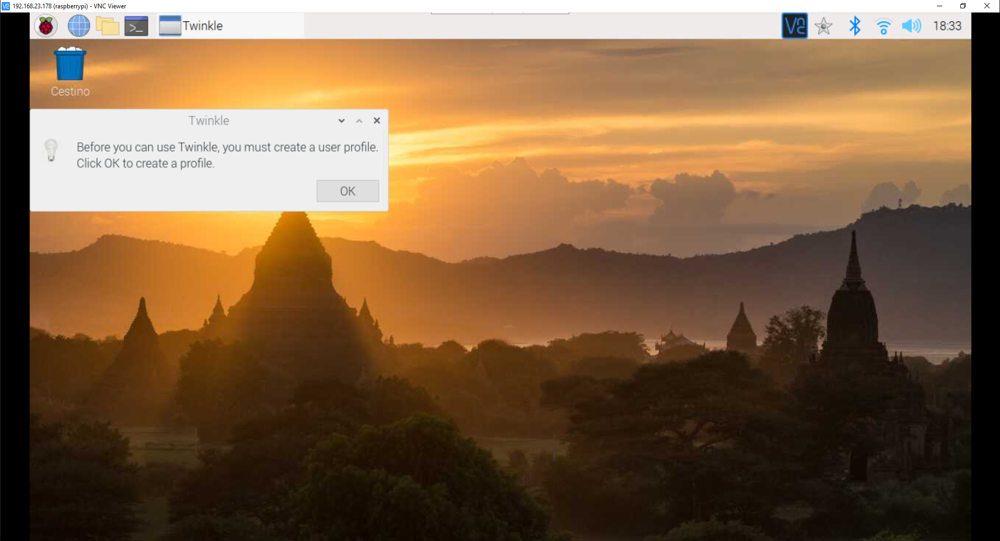

<!-- PROJECT LOGO -->
<br />
<p align="center">
  <a href="https://www.fablabpalermo.org">
    
  </a>

  <h2 align="center">Fabphone</h>

  <h3 align="center">
    Giochiamo tra Fablab con il VoIP e la Digital Fabrication 
  </h3>
</p>                                                                                                                                                                                                                                                                                                                                                                   
<br />


<!-- TABLE OF CONTENTS -->
## Sommario :phone:

* [Descrizione del progetto](#Descrizione-del-progetto)
  * [Hardware, software e competenze necessarie](#Hardware,-software-e-competenze-necessarie)
* [Getting Started](#getting-started)
  * [Installazione software](#Installazione-software)
  * [Assemblaggio hardware](#Assemblaggio-hardware)


<!-- ABOUT THE PROJECT -->
## Descrizione del progetto

Fabphone è un progetto ludico che si inspira ai "telefoni rossi" della guerra fredda. 
Lo scopo del progetto è quello di coinvolgere i Fablab (quelli riportati su fablabs.io) in una iniziativa di co-progettazione attraverso la "gamification": ogni laboratorio costruisce la propria versione di questo telefono VoIP, personalizzando e migliorando hardware e software senza limiti. 
Unica regola: tutti i fabphone devono essere in grado di telefonarsi, costituendo un client di una linea VoIP privata che connette i Fablab per comunicare, sperimentare e giocare. 
Il progetto nasce da Falab Palermo, che ha creato i primi due telefoni e gestisce attualmente la rete VoIP Fabphone.

<!-- Hardware software -->
### Hardware, software e competenze necessarie

Il progetto è stato finora realizzato utilizzando Raspberry Pi 3 e 4, cuffie e microfoni USB, tastierino a membrana a matrice a 16 tasti (4x4), diffusore acustico amplificato.
Sulle Raspberry viene installato Raspbian, un client VoIP (twinkle), un client VPN (openvpn) per la connessione sicura verso il server VoIP, uno script Phyton per l'utilizzo del tastierino a matrice come tastiera, tre script per l'auto-avvio del sistema.
Esiste anche un lato server che verrà descritto ma che non è necessario conoscere nel dettaglio a meno che non si voglia contribuire nel miglioramento e nella gestione della rete VoIP, attualmente gestita da Fablab Palermo su server di un membro del direttivo. 
Le competenze necessarie per riuscire a costruire un Fabphone sono di livello medio basso per quanto riguarda le connessioni tra gli hardware e le installazioni software. Dal punto di vista della costruzione di eventuali "case", Fablab Palermo ha deciso di non condividere nessun file per spingere il più possibile la personalizzazione e quindi le relative competenze di artigianato digitale sono variabili.
Per quanto riguarda il lato server, qualora si voglia contribuire in quel senso, le competenze necessarie spaziano dalla gestione di VPS, al protocollo VPN, all'utilizzo di sistemi Asterisk. Se volete contribuire sul lato server... chiamate Fablab Palermo col vostro Fabphone! (anche una mail andrà benissimo :smile: ).


<!-- GETTING STARTED -->
## Getting Started

Il primo passo è quello di installare il sistema operativo sulla Raspberry, seguendo la guida:
https://projects.raspberrypi.org/en/projects/raspberry-pi-setting-up

Non appena la Raspberry è funzionante con Raspbian, seguite l'installazione guidata al primo avvio, dove vi verrà chiesto di configurare sia la vostra rete sia la vostra password root

Segnatevi la password perché più in là vi servirà


Una volta conclusi l'installazione guidata e l'aggiornamento del sistema, vi verrà richiesto di riavviare.

Una volta riavviato, per evitare che dopo l'assemblaggio di tutto il vostro Fabphone sia sempre necessario collegare la Raspberry a monitor e tastiera per controllarla, vi consigliamo di abilitare sia VNC che SSH, come illustrato nei seguenti screenshot


<br />
<br />

<h2> 
<span style="color: red"> Prima di continuare con l'installazione software si consiglia di contattarci via email per avere sia i setaggi che i file di configurazione per la VPN </span> 
<h1>


<!-- installation -->
## Installazione software


scaricare e installare REALVNC Viwer per il vostro sistema operativo dal link https://www.realvnc.com/en/connect/download/viewer/ 

recuperiamo l'IP della nostra rasp usando il comando 

```sh
ifconfig wlan0     
```


esempio 192.168.137.177

inseriamolo sul software appena scaricato e usiamo i dati di acesso 

ip.jpg


user : pi 

Password : la paswornd che ci siamo salvati durante il primo avvio 


Per prima cosa aprire il terminale 


Controllare di essere nella cartella home con il comando pwd

```sh
pwd
```


Se la cartella è "/home/pi" potete continuare; in caso contrario digitare "cd /home/pi"

```sh
cd /home/pi
```

A questo punto, per avere tutti i file necessari, occorrerà scaricare il contentuto del Git nella cartella Home della propria Raspberry, avviando il terminale e utilizzando il comando "git clone"


```sh
git clone https://github.com/FablabPalermo/fabphone.git
```


Una volta scaricato il Git, usate il comando "cd fabphone" per entrare nella cartella corrispondente


```sh
cd fabphone
```
---

La cartella fabphone contiene 3 script per l'auto-avvio e la cartella VoIP dove al suo interno troverete sia l'audio che viene riprodotto dal fabphone sia lo script python "voip.py", che non fa altro che mandare dei comandi alla pressione dei vari tasti

Scrivendo sul terminale "ls" e premendo invio, vedrete questi file e cartelle 

--openvpn.sh  #script avvio vpn <br />
--voip.sh     #script avvio tastiera fabphone <br />
--twinkle.sh  #script avvio client voip <br />
---voip       #cartella che contine script tastiera e audio <br />
---doc        #cartella che contine le immaggini su gitub

---
Dentro questa cartella deve essere copiato il file che verrà allegato all'email 

esempio:
voip_raspvoip_voip.ovpn

Consigliamo per i meno esperti di copiare il file su una pendrive e copiarlo dentro la cartella fabphone che si trova all'interno della cartella home


Ogni Fablab avrà un file con nome diverso  

Modificare il file -openvpn.sh usando il terminale
```sh
echo "sudo openvpn ~/fabphone/nome-del-vostro-file.ovpn" > openvpn.sh 
```

Dove c'è scritto "nome-del-vostro-file.ovpn", cambiarlo con il nome del file allegato all'email 

Esempio:
```sh
echo "sudo openvpn ~/fabphone/voip_raspvoip_voip.ovpn" > openvpn.sh 
```


Per rendere eseguibili questi script all'avvio, dobbiamo lanciare il comando "chmod +x" sui singoli file per dare il permesso di esecuzione 

```sh
chmod +x openvpn.sh 
chmod +x voip.sh
chmod +x twinkle.sh
```


Ora si dovranno avviare gli script di auto-avvio:

```sh
sudo nano /etc/xdg/lxsession/LXDE-pi/autostart
```


Aggiungere 


```sh
@/home/pi/fabphone/openvpn.sh 
@/home/pi/fabphone/voip.sh
@lxterminal -e /home/pi/fabphone/twinkle.sh
```


Premere la combinazione di tasti "ctrl+x" per salvare


Premere il tasto "S" e dopo premere "invio" per confermare il salvataggio


Per installare tutto il materiale affinché il sistema Fabphone funzioni correttamente, digitare sul terminale 

```sh
sudo apt-get install mpg123 twinkle openvpn -y
sudo pip3 install adafruit-circuitpython-matrixkeypad -y
sudo pip3 install pynput -y
```

Al completamanto di questo passaggio si consiglia un reboot della Raspberry


Ora  occorrerà configurare il client VoIP





Per la corretta configurazione è necessario collegare le cuffie USB alla Rasp in modo da poterle selezionare come dispositivi di comunicazione sul client VoIP.


---
<!-- hardware -->
## Assemblaggio hardware


 


ATTENZIONE! Il suddetto file openvpn va copiato su una sola Rasp, poiché ogni Fabphone, e quindi ogni Rasp, avrà un suo file.  
Copiare lo stesso file su più Rasp provocherà un ban automatico dalla rete VoIP.

Finiti questi passaggi, potete passare all'assemblaggio dell'hardware.

Il collegamento di cuffia con microfono avverrà via USB

Il diffusore acustico amplificato deve invece essere collegato al jack audio della Rasp.

Per il collegamento del tastierino a membrana seguire le seguenti immagini


A questo punto sarà opportuno eseguire un riavvio della Rasp
Se tutto funziona correttamente, al riavvio sentirete tramite il diffusore acustico il messaggio "Fabphone attivo"
Ora potete fare una prima chiamata di test (per la lista nei numeri attivi consultare questo link:...)

IMG Legenda tasti

Per effettuare una chiamata:

 ATTENZIONE! Attualmente non è stato implementato nessun sistema di gestione di avvio/chiusura chiamata attraverso il sollevamento della cornetta

 - Premere il tasto "*"
 - Verrà riprodotto il messaggio "Comporre il numero"
 - Comporre il numero (in caso di errore di digitazione usare il tasto "D")
 - Premere il tasto "B" per fare partire la chiamata
 - Per chiudere la chiamata premere il tasto "C"


